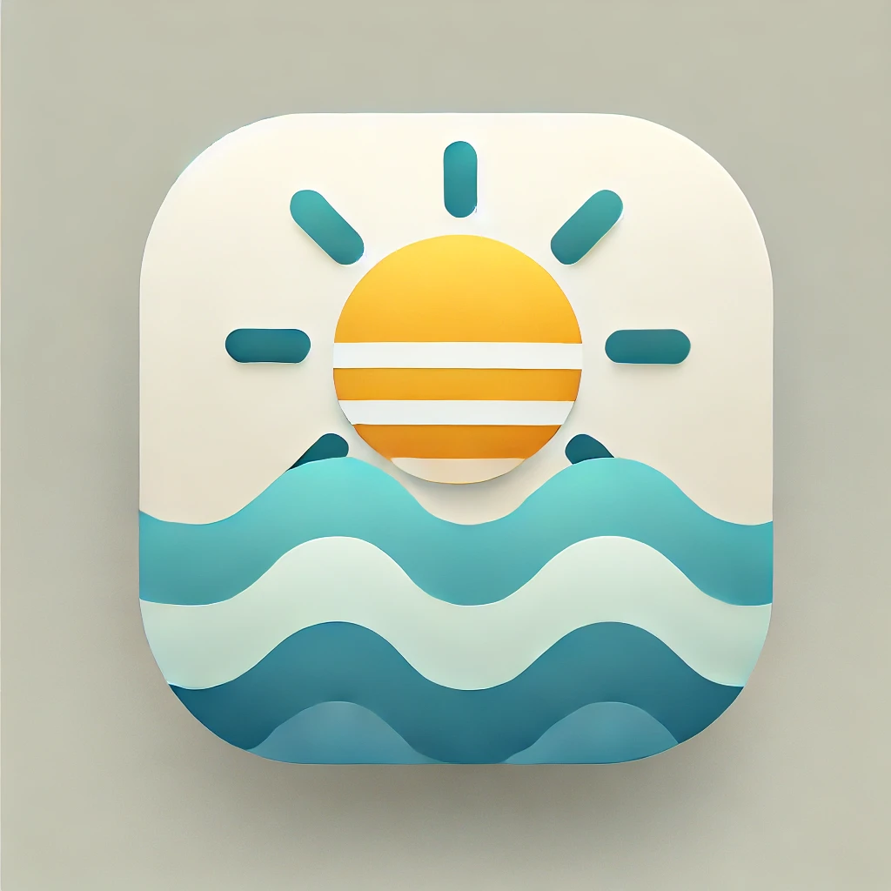

# SALUDABLES



## Introduction

Discover 🏖️ beaches, 🏊 pools, and 🍴 healthy restaurants near you. Live a healthier lifestyle with personalized recommendations.

## Getting Started

To get started with the SALUDABLES project, follow these steps:

1. **Clone the repository:**
   ```bash
   git clone https://github.com/BinniZenobioCordovaLeandro/Saludables.git
   ```
2. **Navigate to the project directory:**
   ```bash
   cd saludables
   ```
3. **Install the dependencies:**
   ```bash
   npm install
   ```
4. **Run the project:**
   ```bash
   npm start
   ```

## Features

- **Beach Finder:** Locate the best beaches near you with detailed information on amenities, water quality, and user reviews.
- **Pool Locator:** Find nearby pools, including public and private options, with details on opening hours, facilities, and entry fees.
- **Healthy Restaurant Guide:** Discover restaurants that offer healthy dining options, complete with menus, nutritional information, and customer ratings.
- **Personalized Recommendations:** Receive tailored suggestions based on your preferences and location to help you maintain a healthy lifestyle.
- **User Reviews and Ratings:** Read and contribute reviews and ratings for beaches, pools, and restaurants to help the community make informed decisions.
- **Interactive Map:** Use the interactive map to explore and navigate to nearby healthy spots with ease.
- **Health Tips and Articles:** Access a collection of articles and tips on healthy living, nutrition, and fitness to support your wellness journey.

## Contributing

We welcome contributions from the community. To contribute, please follow these steps:

1. Fork the repository.
2. Create a new branch (`git checkout -b feature-branch`).
3. Make your changes.
4. Commit your changes (`git commit -m 'Add new feature'`).
5. Push to the branch (`git push origin feature-branch`).
6. Create a new Pull Request.

## License

This project is licensed under the MIT License. See the [LICENSE](./LICENSE) file for details.

## Contact

For any questions or suggestions, please contact us at [contact@saludables.com](mailto:contact@saludables.com).


